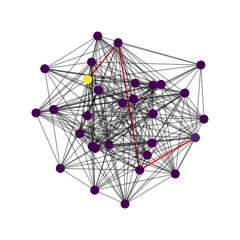
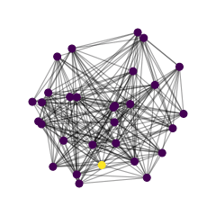

# networkMDE 
This repository aims to implement some **network embedding algorithms** (MDE, t-SNE, UMAP) for dimensionality reduction and other networks-related stuff (processes over networks, maybe also _leaky integrate-and-fire_ for SNN in future, assuming my dexterity is sufficient).

At the moment it represents just **a workbech for my personal coding skills**.

## Overview
Most of the code is written in python3 but I had to resort to **extending  with C** for the most resource-expensive tasks.

The conceptual points of greater interest for me are:

- designing an appropriate **data structure** to avoid data redundancy
- ensuring a good **management of the data** between Python and C modules
- (possibly) **multiprocessing**
- (even more possibly) **GPU processing**
- finding an efficient way to **display** the data

 

